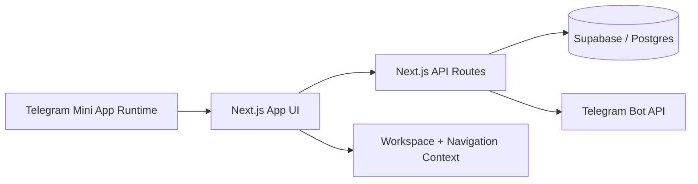

# Payment Control

**Payment Control** is a Telegram Mini App for everyday money routines:
- recurring payments and subscriptions,
- shared family context,
- group travel expense tracking with settlements.

It is built for short, practical sessions: open the app, do one useful action, close it.


## What Is This?

Payment Control helps you manage three real-life scenarios in one mobile-first workflow:
1. **Recurring routine**: track monthly/weekly payments, reminders, and payment cycles.
2. **Shared context**: keep personal and family workspace usage organized.
3. **Travel groups**: split trip expenses, review receipts, and settle balances clearly.

## Why It Feels Useful

1. **Action-first surfaces**: each main screen has a clear next step.
2. **Low-friction daily use**: optimized for quick check-ins, not long admin sessions.
3. **Calm secondary flows**: helper/manage actions are moved to focused modal layers.
4. **No paywall for core usage**: product access is not gated by premium unlocks.

## Core Product Surfaces

| Surface | Main Purpose | Typical Actions |
|---|---|---|
| **Home** | Snapshot + next action | Open recurring routine, jump to history/travel |
| **Recurring** | Regular payments workspace | Add/edit/archive payment, mark paid/undo paid, focus by urgency |
| **Travel** | Group trip workspace | Create/join trip, manage participants, add expenses, settlements, receipts |
| **History** | Recent payment timeline | Review updates and paid events with focus options |
| **Profile** | Workspace/settings/support | Language/theme, onboarding replay, bug report, family workspace tools |

## Feature Highlights

### Recurring payments
- Create and manage recurring entries (weekly/monthly).
- Payment cycle state (`paid` / `unpaid`) with fast actions.
- Subscription-friendly handling (including pause/resume).
- Family-aware shared payment scope.

### Travel groups
- Trip lifecycle from active work to completion/archive.
- Participant roles and active/inactive member states.
- Expense split modes, balances, and settlement plan.
- Multi-currency support with fixed-rate conversion per expense.
- Receipt drafts + OCR-assisted review with manual confirmation.

### Shared app foundations
- Workspace context (personal/family).
- Clean history view for recent operational changes.
- In-app bug report flow.
- Telegram-aware localization behavior (Telegram language source + manual override).

## Product Architecture (High Level)



## Screenshots

Real runtime screenshots are not bundled in this repository yet.  
When added, they will be published in `docs/media/readme/` and linked here.

## Tech Stack

- **Frontend**: Next.js 16, React 19, TypeScript
- **Backend layer**: Next.js API routes
- **Data**: Supabase (Postgres + auth context integration)
- **Platform**: Telegram Mini App runtime
- **Analytics**: Telegram Analytics SDK wiring in client runtime

## Run Locally

### 1) Install dependencies

```bash
npm install
```

### 2) Configure environment

```bash
cp .env.example .env.local
```

Set the required values in `.env.local` for your local runtime.

### 3) Start dev server

```bash
npm run dev
```

### 4) Build check

```bash
npm run lint
npm run build
```

## Repository Notes

- The app is organized around product surfaces in `src/components/app/`.
- API routes are under `src/app/api/`.
- Database migrations are under `supabase/migrations/`.
- Additional project documentation is under `docs/`.

## Contributing

Issues and pull requests are welcome for:
1. UX clarity improvements,
2. runtime reliability fixes,
3. quality-of-life enhancements that keep flows simple.

Please keep changes practical, scoped, and aligned with existing product behavior.

## Community & Trust

- [Contributing guide](./CONTRIBUTING.md)
- [Code of Conduct](./CODE_OF_CONDUCT.md)
- [Security policy](./SECURITY.md)
- [Support channels](./SUPPORT.md)

## Project Status

Payment Control is in active development with a stable core baseline for recurring flows and a mature Travel v1 branch.

## License

This project is licensed under the [MIT License](./LICENSE).
